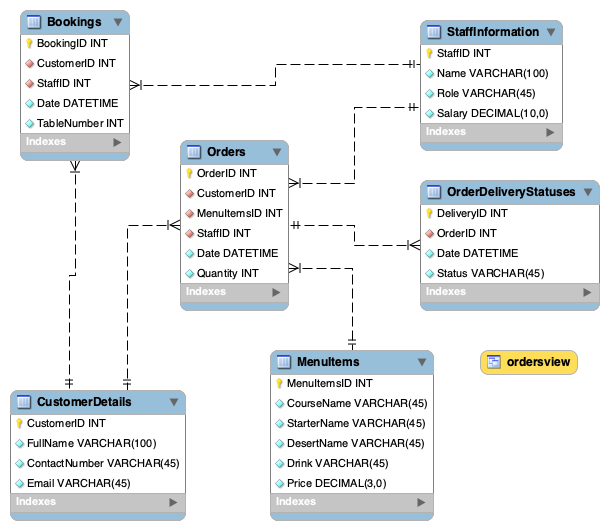
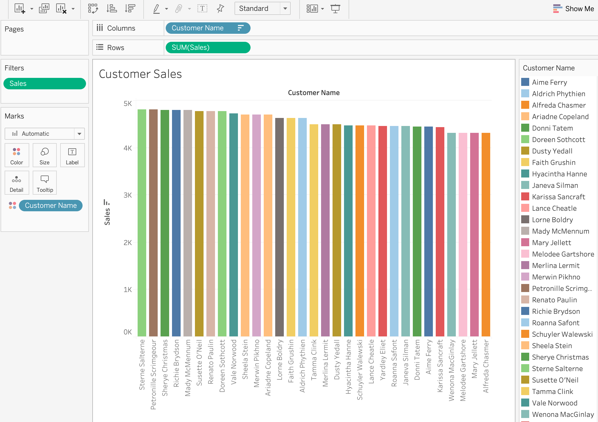
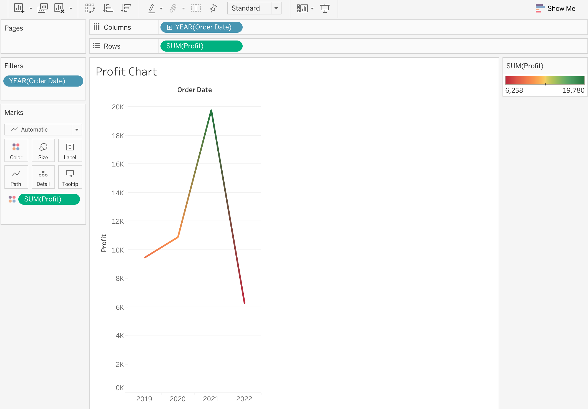
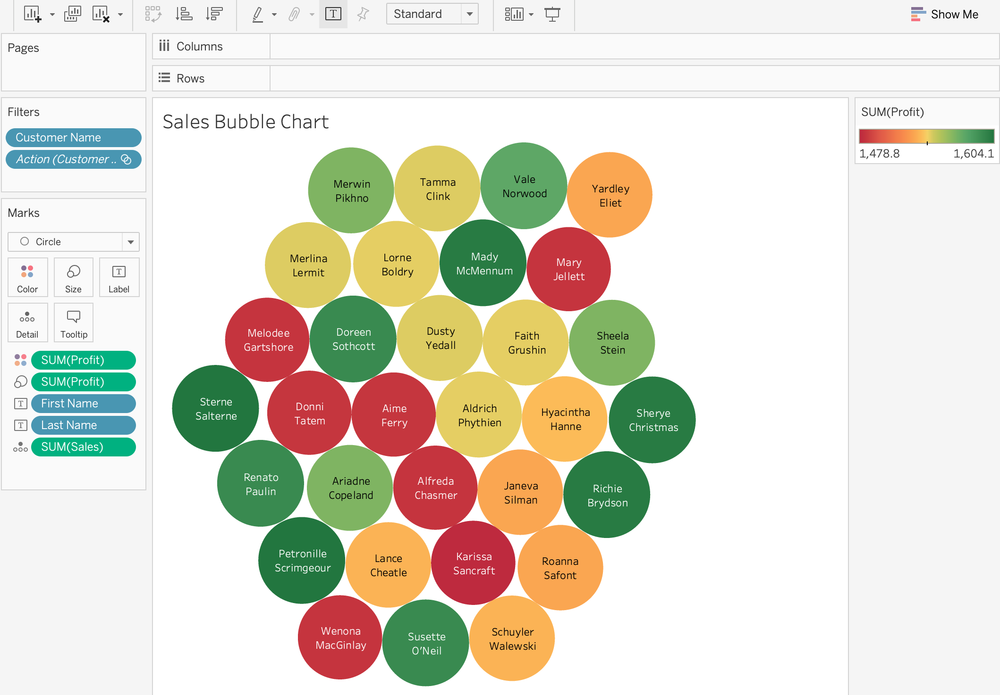
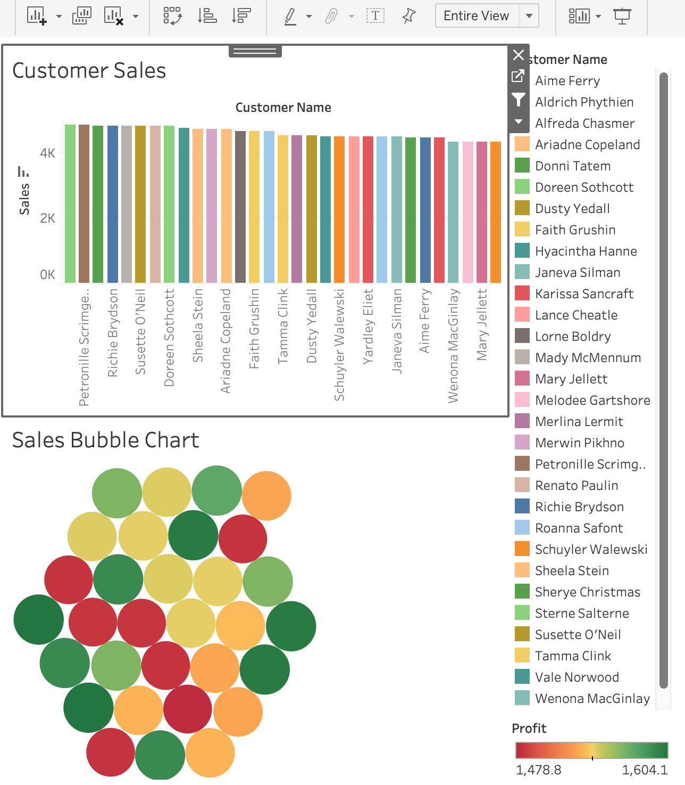

---
jupyter:
  kernelspec:
    display_name: Python 3 (ipykernel)
    language: python
    name: python3
  language_info:
    codemirror_mode:
      name: ipython
      version: 3
    file_extension: .py
    mimetype: text/x-python
    name: python
    nbconvert_exporter: python
    pygments_lexer: ipython3
    version: 3.11.5
  nbformat: 4
  nbformat_minor: 5
---

<div class="cell markdown">

# Little Lemon Restaurant Database

</div>

<div class="cell markdown">

-   [Project Description](#project-description)
-   [Entity-Relationship Diagram](#entity-relationship-diagram)
-   [Installation and Setup](#installation-and-setup)
-   [Stored Procedures](#stored-procedures)
    -   [AddValidBooking](#addvalidbooking)
    -   [CheckBooking](#checkbooking)
    -   [UpdateBooking](#updatebooking)
    -   [CancelBooking](#cancelbooking)
    -   [CancelOrder](#cancelorder)
    -   [AddBooking](#addbooking)
    -   [GetMaxQuantity](#getmax)
-   [Data Analysis with Tableau](#data-analysis-with-tableau)
    -   [Customer Sales](#customer-sales)
    -   [Profit Chart](#profit-chart)
    -   [Sales Bubble Chart](#sales-bubble-chart)
    -   [Cuisine Sales and Profits](#cuisine-sales-and-profits)
    -   [Dashboard](#dashboard)

</div>

<div class="cell markdown">

## Project Description

</div>

<div class="cell markdown">

This project is part of **Meta Database Engineer Certificate** courses
on Coursera. The project designs and implements a relational database
system for Little Lemon Restaurant. MySQL is used for data modeling and
Tableau is used for data analytics and visualization.

</div>

<div class="cell markdown">

## Entity-Relationship Diagram

</div>

<div class="cell markdown">

The database maintains the following information about the business:

-   Bookings
-   Orders
-   Order delivery status
-   Menu
-   Customer details
-   Staff information

The entity-relationship (ER) [diagram](./images/diagram.png) below
displays the relationships between these entities.


</div>

<div class="cell markdown">

## Installation and Setup

</div>

<div class="cell markdown">

Follow the steps below to setup the database:

1.  **Install MySQL:** Download and install MySQL Server and MySQL
    Workbench on your machine.

2.  **Download SQL File:** Download the
    [little_lemon_db.sql](../db-capstone-project/little_lemon_db.sql)
    file from this repository.

3.  **Import and Execute in MySQL Workbench:**

    -   Open MySQL Workbench
    -   Navigate to `Server` \> `Data Import`
    -   Select `Import from Self-Contained Files` from the
        `Import Options` pane and load the `little_lemon_db.sql` file.
    -   Click `Start Import` to load and execute the SQL commands from
        the file.

The database is now set up with tables and stored procedures populated.

</div>

<div class="cell markdown">

## Stored Procedures

</div>

<div class="cell markdown">

### AddValidBooking

</div>

<div class="cell markdown">

This stored procedure uses a **transaction statement** to perform a
**rollback** if a customer reserves a table that is already booked at
the specified datetime. Otherwise, a new valid reservation is added to
the database. The procedure takes four input parameters (booking
datetime, table number, customer id, and staff id) and output a message
either confirming valid reservation is completed or the table has been
booked and the reservation attempt is therefore cancelled.

</div>

<div class="cell markdown">

``` sql
DELIMITER //
CREATE PROCEDURE AddValidBooking(IN booking_datetime DATETIME, IN booking_table INT, IN customer_id INT, IN staff_id INT)
BEGIN
	DECLARE booking_count INT;
    START TRANSACTION;
    
    SELECT COUNT(*) INTO booking_count
    FROM Bookings
    WHERE Date = booking_datetime AND TableNumber = booking_table;
    
    IF booking_count > 0 THEN
		ROLLBACK;
        SELECT CONCAT("Table ", booking_table, " is unavailable -- booking cancelled!") AS 'Status';
	ELSE
		INSERT INTO Bookings(CustomerID, StaffID, Date, TableNumber)
        VALUES(customer_id, staff_id, booking_datetime, booking_table);
        
        COMMIT;
        SELECT CONCAT("Booking successfully completed for table ", booking_table);
    END IF;
END //
DELIMITER ;
```

</div>

<div class="cell markdown">

``` sql
CALL AddValidBooking("2024-02-02 12:30:00", 3, 6, 2);
```

</div>

<div class="cell markdown">

### CheckBooking

</div>

<div class="cell markdown">

This stored procedure checks whether a table in the restaurant is
already booked. It takes two input parameters in the form of booking
datetime and table number. It outputs a message indicating whether the
specified table is already booked or is available.

</div>

<div class="cell markdown">

``` sql
DELIMITER //
CREATE PROCEDURE CheckBooking(IN booking_datetime DATETIME, IN booking_table INT)
BEGIN
	DECLARE booking_count INT;
    DECLARE table_status VARCHAR(45);
    
	SELECT COUNT(*) INTO booking_count 
	FROM Bookings
	WHERE Date = booking_datetime AND TableNumber = booking_table;

	IF booking_count > 0 THEN 
		SET table_status = 'already booked';
	ELSE
		SET table_status = 'available';
	END IF;
    
    SELECT CONCAT('Table ', booking_table, ' is ', table_status);
END //
DELIMITER ;
```

</div>

<div class="cell markdown">

``` sql
CALL CheckBooking("2024-02-01 12:00:00", 5);
```

</div>

<div class="cell markdown">

### UpdateBooking

</div>

<div class="cell markdown">

This stored procedure update existing bookings in the `Bookings` table.
It takes two input parameters (booking id and new datetime) and output a
messge indicating the booking is updated.

</div>

<div class="cell markdown">

``` sql
DELIMITER //
CREATE PROCEDURE UpdateBooking(IN booking_id INT, IN new_datetime DATETIME)
BEGIN
	UPDATE Bookings
    SET Date = new_datetime
    WHERE BookingID = booking_id;
    
    SELECT CONCAT("Booking ", booking_id, " updated.") AS "Confirmation";
END //
DELIMITER ;
```

</div>

<div class="cell markdown">

``` sql
CALL UpdateBooking(9, "2024-02-01 12:30:00")
```

</div>

<div class="cell markdown">

### CancelBooking

</div>

<div class="cell markdown">

This stored procedure cancels an existing booking by deleting it from
the `Bookings` table. It takes a booking id as input and output a
confirmation message indicating the specified booking is cancelled.

</div>

<div class="cell markdown">

``` sql
DELIMITER //
CREATE PROCEDURE CancelBooking(IN booking_id INT)
BEGIN
	DELETE FROM Bookings
    WHERE BookingID = booking_id;
    
    SELECT CONCAT("Booking ", booking_id, " is cancelled.") AS "Confirmation";
END //
DELIMITER ;
```

</div>

<div class="cell markdown">

``` sql
CALL CancelBooking(9)
```

</div>

<div class="cell markdown">

### CancelOrder

</div>

<div class="cell markdown">

This stored procedure is used to delete an order record based on the
user input of the order id.

</div>

<div class="cell markdown">

``` sql
DELIMITER //
CREATE PROCEDURE CancelOrder(IN delete_order_id INT)
BEGIN
	DECLARE order_quantity INT;
    SELECT Quanity INTO order_quantity FROM Orders WHERE OrderID = delete_order_id;
    IF order_quantity > 0 THEN
		DELETE FROM Orders WHERE OrderID = delete_order_id;
        DELETE FROM OrderDeliveryStatuses WHERE OrderID = delete_order_id;
        SELECT CONCAT('Order ', delete_order_id, ' is cancelled') AS 'Confirmation';
	ELSE
		SELECT CONCAT('Order ', delete_order_id, ' does not exist') AS 'Confirmation';
	END IF;
END //
DELIMITER ;
```

</div>

<div class="cell markdown">

``` sql
CALL CancelOrder(5)
```

</div>

<div class="cell markdown">

### AddBooking

</div>

<div class="cell markdown">

This store procedure add new booking to the `Bookings` table. It takes
four input parameters (booking datetime, table number, customer id, and
staff id) and output a message confirming the new table reservation.

</div>

<div class="cell markdown">

``` sql
DELIMITER //
CREATE DPROCEDURE AddBooking(
	IN booking_id INT,
    IN customer_id INT,
    IN staff_id INT,
    IN booking_datetime DATETIME,
    IN booking_table INT
)
BEGIN
	INSERT INTO Bookings(BookingID, CustomerID, StaffID, Date, TableNumber)
    VALUES(booking_id, customer_id, staff_id, booking_datetime, booking_table);
    
    SELECT "New booking added." AS "Confirmation";
END //
DELIMITER ;
```

</div>

<div class="cell markdown">

``` sql
CALL AddBooking("2024-02-02 12:30:00", 3, 6, 2)
```

</div>

<div class="cell markdown">

### GetMaxQuanity

</div>

<div class="cell markdown">

This stored procedure retrieve the maximum order quantity in the
`Orders` table.

</div>

<div class="cell markdown">

``` sql
DELIMITER //
CREATE PROCEDURE GetMaxQuanity()
BEGIN
	DECLARE max_quantity INT;
    SELECT MAX(Quantity) INTO max_quantity FROM Orders;
    SELECT max_quantity AS 'Max Quanity in Order';
END //
DELIMITER ;
```

</div>

<div class="cell markdown">

``` sql
CALL GetMaxQuantity()
```

</div>

<div class="cell markdown">

## Data Analysis with Tableau

</div>

<div class="cell markdown">

You may view the interactive dashboard or download the complete Tableau
Public workbork
[<u>here</u>](https://public.tableau.com/app/profile/le.phan3723/viz/little-lemon-restaurant-sales-analysis/CustomerSalesDashboard)
on my Tableau Public profile. This workbook contains the following
analyses:

1.  Customer Sales
2.  Profit Chart
3.  Sales Bubble Chart
4.  Cuisine Sales and Profits
5.  Customer Sales Dashboard

</div>

<div class="cell markdown">

### Customer Sales

</div>

<div class="cell markdown">



</div>

<div class="cell markdown">

### Profit Chart

</div>

<div class="cell markdown">



</div>

<div class="cell markdown">

### Sales Bubble Chart

</div>

<div class="cell markdown">



</div>

<div class="cell markdown">

### Cuisine Sales and Profits

</div>

<div class="cell markdown">


</div>

<div class="cell markdown">

### Dashboard

</div>

<div class="cell markdown">



</div>

<div class="cell code">

``` python
```

</div>
